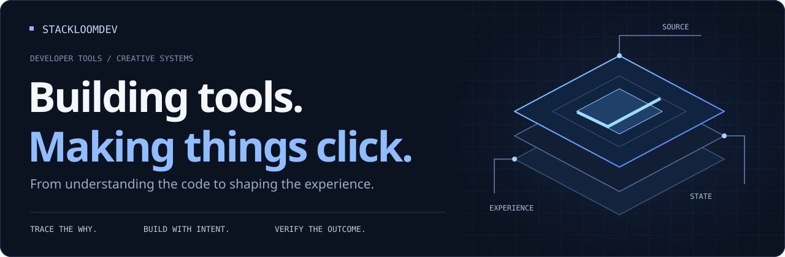
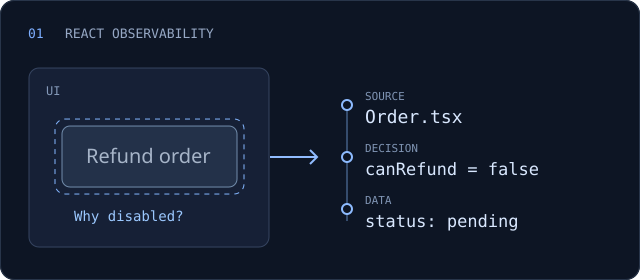
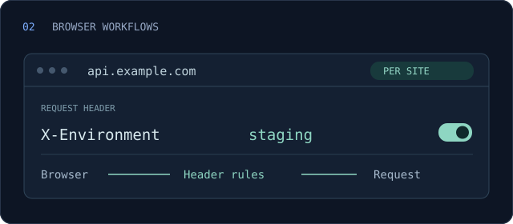
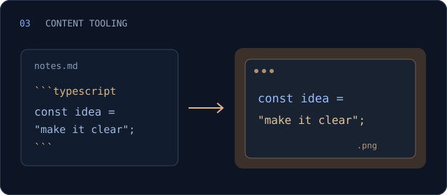
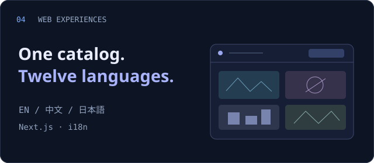

  

### Hi, I'm stackloomdev.

I build **developer tools**, **AI-assisted creator workflows**, and **interactive web experiences**. I like turning a hard-to-explain problem into something you can inspect, understand, and use.

做让复杂问题更清晰的工具，也做值得探索的网页体验。

**[Read my blog ↗](https://blog.stackloom.org)** &nbsp; · &nbsp; [Explore the projects](#selected-work) &nbsp; · &nbsp; [Visit the creative lab](#creative-lab)

## Selected work

Practical tools for everyday engineering, with room for creative exploration.

<table>
<tr>
<td width="50%" valign="top">

<h3><a href="https://github.com/stackloomdev/causescope">CauseScope</a></h3>

<strong>Click any UI. Trace the cause.</strong>

Follow a rendered React element back to its TSX, the decision that produced it, and the state or network data behind it.

<code>TypeScript</code> <code>React</code> <code>Vite</code>

<a href="https://stackloomdev.github.io/causescope/">Documentation ↗</a> · <a href="https://github.com/stackloomdev/causescope">Source</a> Beta · React + Vite today

</td>
<td width="50%" valign="top">

<h3><a href="https://github.com/stackloomdev/request-kit">RequestKit</a></h3>

<strong>Your headers. The right scope.</strong>

A Chrome extension for custom request headers, with per-site profiles, an all-sites mode, and configuration stored locally.

<code>JavaScript</code> <code>Chrome MV3</code>

<a href="https://github.com/stackloomdev/request-kit#build-and-install">Install guide ↗</a> · <a href="https://github.com/stackloomdev/request-kit">Source</a> Browser extension · No account required

</td>
</tr>
<tr>
<td width="50%" valign="top">

<h3><a href="https://github.com/stackloomdev/md-code-image-cli">md-code-image-cli</a></h3>

<strong>From code blocks to shareable visuals.</strong>

Turn Markdown fenced code blocks into syntax-highlighted PNGs in pure Node.js, with themes and Chinese font fallback.

<code>TypeScript</code> <code>Node.js</code> <code>Shiki</code>

<a href="https://www.npmjs.com/package/md-code-image-cli">npm package ↗</a> · <a href="https://github.com/stackloomdev/md-code-image-cli">Source</a> CLI · Built for writing and sharing

</td>
<td width="50%" valign="top">

<h3><a href="https://github.com/stackloomdev/astra-games">Astra Games</a></h3>

<strong>A catalog that speaks twelve languages.</strong>

A multilingual showcase for AI-assisted games, with localized project pages and a catalog synced from its upstream collection.

<code>Next.js</code> <code>TypeScript</code> <code>i18n</code>

<a href="https://astragames.aigccreative.com">Explore the site ↗</a> · <a href="https://github.com/stackloomdev/astra-games">Source</a> Web experience · 12 languages, including RTL

</td>
</tr>
</table>

<strong>See CauseScope in action — from a disabled button to the data behind it</strong>

 

  

<a href="https://stackblitz.com/fork/github/stackloomdev/causescope/tree/main/examples/stackblitz?title=CauseScope%20Live%20Lab">Try the interactive lab ↗</a>

## Creative lab

The browser is also a place to play. I explore atmosphere, interaction, and game systems through small playable worlds.

Inside Silent Meridian · The observatory, suspended at 00:17.

| World | What you'll find | Explore |
| :--- | :--- | :--- |
| **[Silent Meridian · 静默子午线](https://github.com/stackloomdev/silent-meridian)** | An atmospheric puzzle game. Shift between the Present and its Echo across four chapters and thirteen puzzles. | [Play ↗](https://silent-meridian.stackloom.org/) |
| **[Last Beacon · 最后的灯塔](https://github.com/stackloomdev/last-beacon)** | An isometric island defense game. Connect the power grid, build defenses, and keep the lighthouse alive. | [Play ↗](https://last-beacon.loupengju.cc/) |
| **[Ink Blade · 墨刃](https://github.com/stackloomdev/ink-blade)** | An ink-inspired action prototype built with Three.js and WebGL 2. Combos, parries, and a rain-soaked bamboo forest. | [Play ↗](https://ink-blade.stackloom.org/) |

## Tools & approach

**Interfaces** &nbsp; `TypeScript` `JavaScript` `React` `Next.js` `Vite` 
**Developer tools** &nbsp; `Node.js` `Chrome Extensions` `CLI` 
**Creative work** &nbsp; `Three.js` `WebGL` `AI-assisted workflows`

- **Understand the mechanism.** Follow the interface back to the code and data that shape it.
- **Keep changes focused.** Solve the actual problem and preserve what already works.
- **Check the experience.** Verify the outcome in the browser, beyond passing build checks.

---

**Notes from the workbench** — I write at **[blog.stackloom.org ↗](https://blog.stackloom.org)**. 
Questions or ideas about a project? Its repository is a good place to start.

Built with curiosity. Refined through use.
